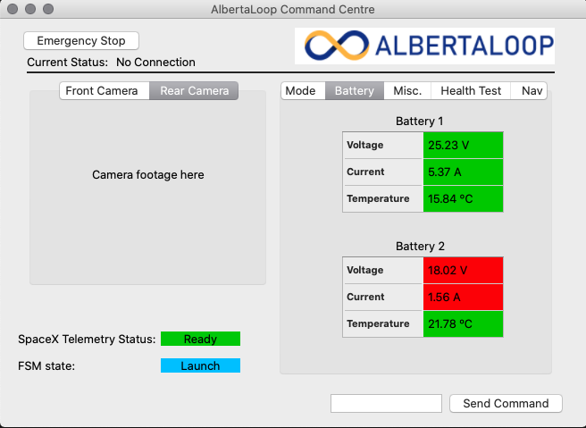

# AlbertaLoop GUI
**Note**: This is currently a work-in-progress

The pod UI is written in PyQt, which allows for easy hierarchical and modular organization. This is just a front-end representation of the interface, built using **Qt Creator**. The signals and actions need to be coded by hand moving forward, to allow the button presses to work, and further actions to take place.

## Screenshots and GIFS
### **Checkpoint 1**: Basic layout and tabs created
*Mode* tab:


*Battery* tab:



*Misc.* tab:


*Health Test* tab:


*Navigation* tab:


## Build Process
The interface is created using **Qt Creator**, which produces a .ui file. To convert the .ui file into python code, use the following command in the terminal:
```
pyuic5 <.ui file> -o <python filename>
```
This will translate the .ui file into a .py file, and if you run the python program, it should produce the same design that was worked on within Qt Creator.

## Information to be added
As this is still a work in progress, information that is yet to be added to the interface is listed below:

* Quality logo/icons to use
* Font style to use
* Telemetry values of position/velocity
* Telemetry values of time + software state
* FSM state
* SpaceX Telemetry Status
* Navigation Panel
* Pod path visualization
* Simulation
* Health Test
* Configuration sliders/input


## References
A list of useful references and documents that were useful while building the interface:

* [MIT Final Report](http://web.mit.edu/mopg/www/papers/MITHyperloop_FinalReport_2017_public.pdf)

